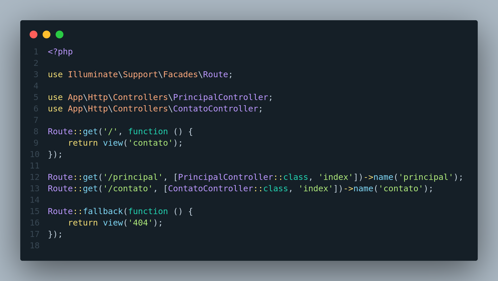
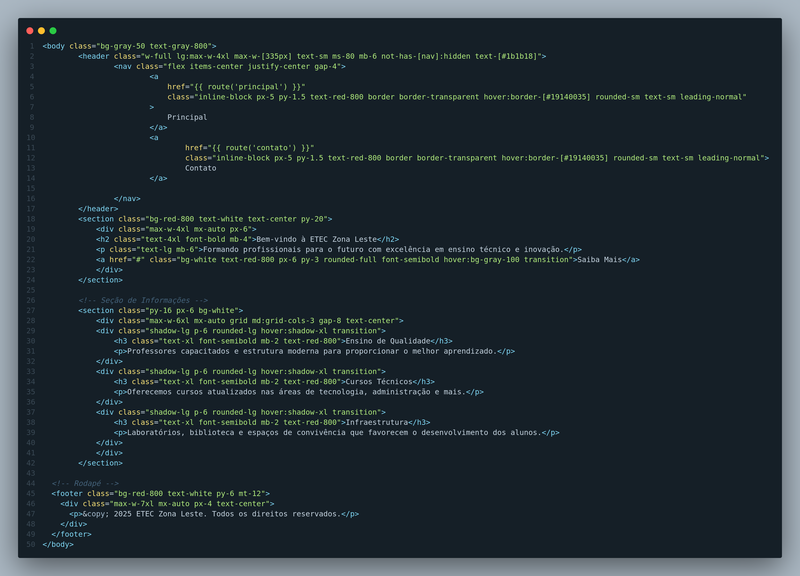
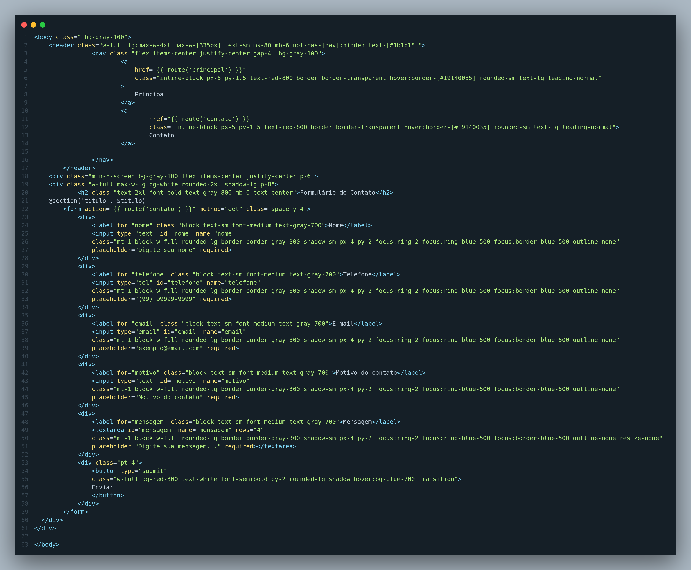
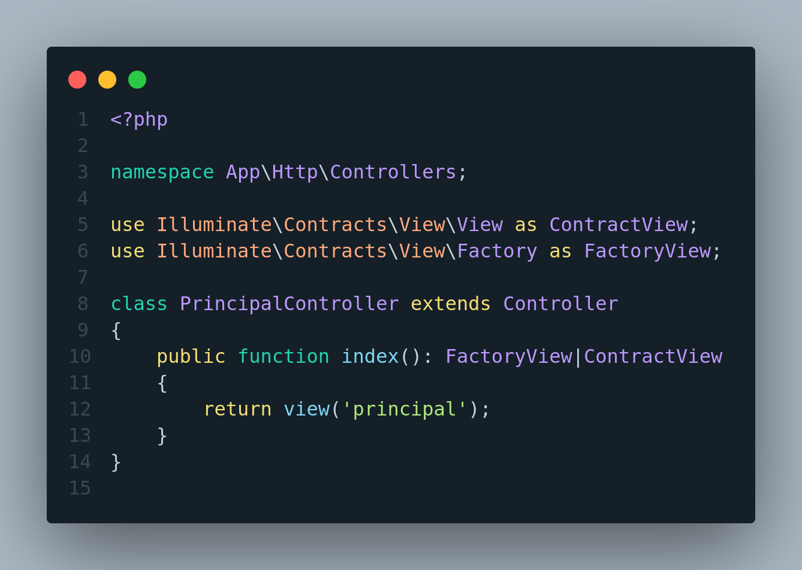
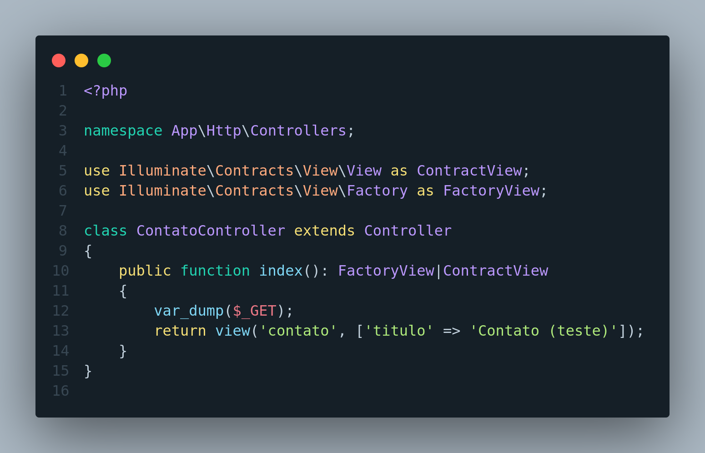
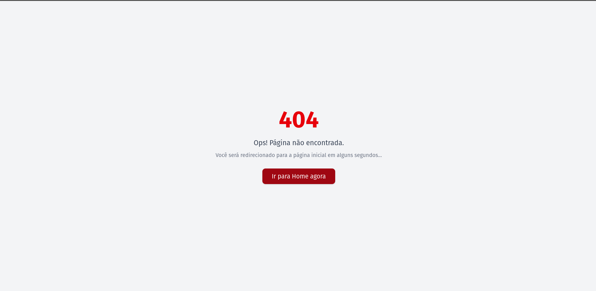
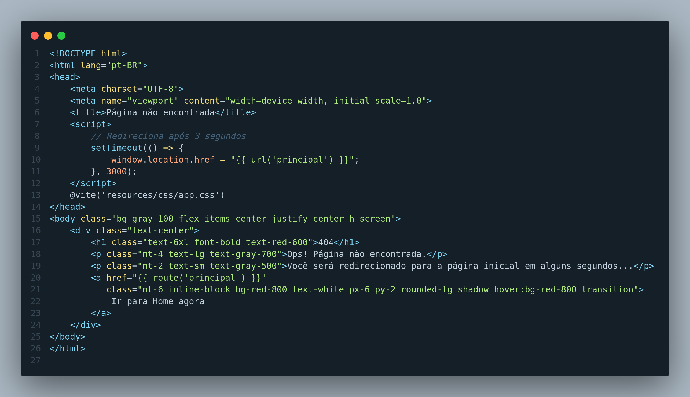
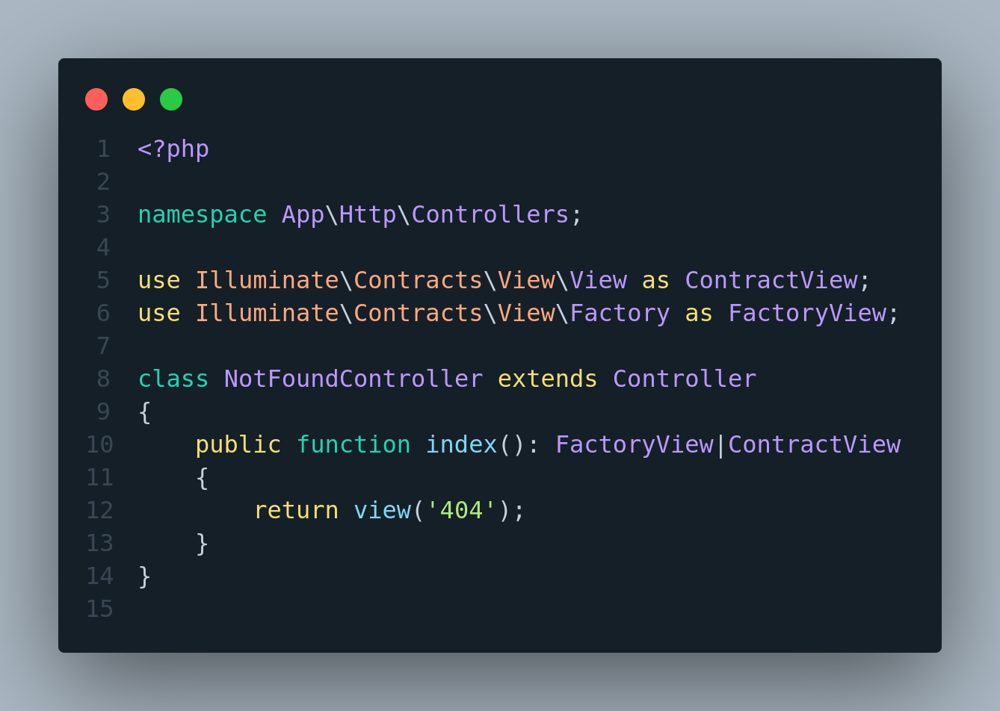
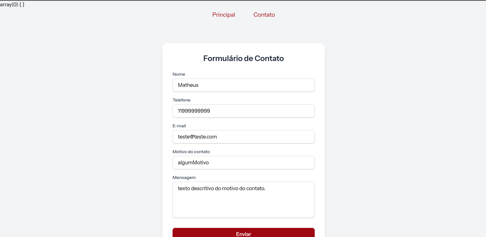
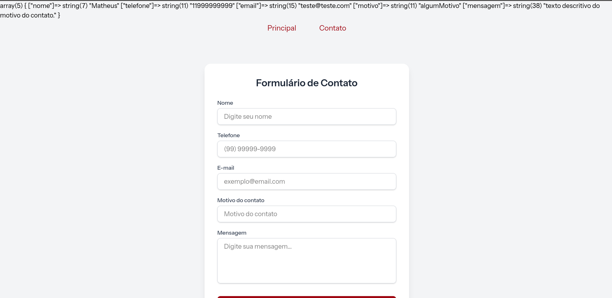

# Atividade 3 - Formularío - Usando o var_dump (Matheus Jorge Santana)

Aqui você poderá ver como eu criei esse projeto e sobre a documentação do Laravel

## Requisitos para usar o Laravel

- Composer instalado - [Composer Download](https://getcomposer.org/)
- PHP instalado - [PHP Download](https://www.php.net/)
- NPM e Node instalado - [NPM e Node Download](https://nodejs.org/pt)
- Laravel instalado - [Laravel Download](https://laravel.com/docs/12.x)
- MySQL (caso você opte por ele) - [MySQL Download](https://www.mysql.com/downloads/)
- IDE para poder codar - __VS Code é recomendado__ [VS Code Download](https://code.visualstudio.com/)

_Você pode baixar o Composer e o PHP diretamente pelo site do [Laravel](https://laravel.com/docs/12.x)_

## Criando o projeto

- Para criar um projeto usando o Laravel rode o comando ```laravel new nome-do-projeto```

- Não usei nenhum _starter kit_, mas você pode escolher algum se você quiser :)


Após esse comando o Laravel vai lhe fazer algumas perguntas de como você quer configurar o seu projeto.

-----------

### Escolhendo o Banco de Dados

- Agora o Laravel irá perguntar qual banco de dados você quer. Para a criação desse projeto em específico eu usei o ```MySQL```, mas se você preferir/necessitar de outro banco de dados não tem problema nenhum.
  
- Ele também pergunta se você quer fazer as migrations que vem por padrão, escolha _Yes_ para facilitar o processo.

___Atenção! Caso você não tenha o MySQL instalado na sua máquina o projeto não irá rodar! - [Link de Instalação do MySQL](https://www.mysql.com/downloads/)___


-----------

### Rodando comandos NPM (Node Package Manager)

- O Laravel pergunta se você quer rodar os comandos ```npm run build && npm run dev```, selecione _Yes_.
  
    - ```npm run build``` serve para compilar os arquivos frontend (CSS, JS, etc.) para produção.
      
    - ```npm run dev``` serve para iniciar o ambiente de desenvolvimento. Podendo ativar o ___hot reload___ (atualiza automaticamente o navegador quando você salva um arquivo) e permitindo desenvolvimento com feedback rápido.
      
- _Caso não apareça a opção de rodar os comandos, simplesmente digite eles no terminal e os rode_


-----------

### Rodando o projeto

- Digite o comando ```cd nome-do-projeto``` para entrar no diretório do projeto
  
- Digite o comando ```composer run dev``` para rodar o projeto.
  
    - Esse comando roda uma série de outros comandos que basicamente liga todo o ambiente de desenvolvimento Laravel. Você pode verificar os comandos especificamente no arquivo ```composer.json```.
        
        - Backend
        - Filas de jobs
        - Monitoramento de logs
        - Frontend  


## Routes

O arquivo ```web.php``` define quais são as rotas das páginas do projeto. No arquivo abaixo você poderá ver todas as rotas do projeto:



## Layouts das telas

Aqui você pode ver como ficaram as telas do site, podendo ver o seu layout. Também terá a print dos códigos.

#### Principal

<div align="center">
    
    <p>Tela Principal</p>
    <br>
    
    <p>Código da Tela Principal</p>
</div>

#### Contato

<div align="center">
    
    <p>Tela Contato</p>
    <br>
    
    <p>Código da Tela Contato</p>
</div>

## Controllers

Os controllers do projeto foram contruídos de maneira simples, basicamente no ```PrincipalController.php``` foi criada uma função index para retornar a view indicada, na ```ContatoController.php``` tem a mesma função com a diferença de que foi adicionado um ```var_dump($_GET)``` que basicamente pega o valor que o método _GET_ recebe, embaixo a view retorna com o valor do ```var_dump```. Abaixo você poderá ver como os controllers do projeto foram desenvolvidos para atender os requisitos da atividade.


#### Principal Controller

<div align="center">
    
    <p>Principal Controller</p>
</div>

#### Contato Controller


<div align="center">
    
    <p>Contato Controller</p>
</div>

## Rota Fallback

A rotafallback serve para quando alguma url for digitada incorretamente dentro da nossa página, o laravel direcione a alguma página específica de erro. Veja abaixo a tela de fallback:

<div align="center">
    
    <p>Tela de Fallback</p>
    <br>
    
    <p>Código da Tela de Fallback</p>
    <br>
    
    <p>Código do Controller Fallback</p>
</div>

## Var_dump na prática

Agora preencheremos o nosso formulário com as informações necessárias para ver se as mesmas são capturadas de maneira correta.



- Clicando no botão enviar veremos se as informações foram capturadas



-----------

## Conclusão

Vemos que poderoso framework é o Laravel, podemos depurar o código utilizando as variáveis corretas, assim, entendendo quais valores as nossas variáveis estão recebendo. Espero que você tenha aprendido mais um pouco de como desenvolver aplicações Web com Laravel e PHP. Tenha um ótimo dia 😄!

_A partir daqui é as informações do Laravel que vem por padrão em todo projeto criado com o framework._

-----------


<p align="center"><a href="https://laravel.com" target="_blank"></a></p>

<p align="center">
<a href="https://github.com/laravel/framework/actions"></a>
<a href="https://packagist.org/packages/laravel/framework"></a>
<a href="https://packagist.org/packages/laravel/framework"></a>
<a href="https://packagist.org/packages/laravel/framework"></a>
</p>

## About Laravel

Laravel is a web application framework with expressive, elegant syntax. We believe development must be an enjoyable and creative experience to be truly fulfilling. Laravel takes the pain out of development by easing common tasks used in many web projects, such as:

- [Simple, fast routing engine](https://laravel.com/docs/routing).
- [Powerful dependency injection container](https://laravel.com/docs/container).
- Multiple back-ends for [session](https://laravel.com/docs/session) and [cache](https://laravel.com/docs/cache) storage.
- Expressive, intuitive [database ORM](https://laravel.com/docs/eloquent).
- Database agnostic [schema migrations](https://laravel.com/docs/migrations).
- [Robust background job processing](https://laravel.com/docs/queues).
- [Real-time event broadcasting](https://laravel.com/docs/broadcasting).

Laravel is accessible, powerful, and provides tools required for large, robust applications.

## Learning Laravel

Laravel has the most extensive and thorough [documentation](https://laravel.com/docs) and video tutorial library of all modern web application frameworks, making it a breeze to get started with the framework.

You may also try the [Laravel Bootcamp](https://bootcamp.laravel.com), where you will be guided through building a modern Laravel application from scratch.

If you don't feel like reading, [Laracasts](https://laracasts.com) can help. Laracasts contains thousands of video tutorials on a range of topics including Laravel, modern PHP, unit testing, and JavaScript. Boost your skills by digging into our comprehensive video library.

## Laravel Sponsors

We would like to extend our thanks to the following sponsors for funding Laravel development. If you are interested in becoming a sponsor, please visit the [Laravel Partners program](https://partners.laravel.com).

### Premium Partners

- **[Vehikl](https://vehikl.com)**
- **[Tighten Co.](https://tighten.co)**
- **[Kirschbaum Development Group](https://kirschbaumdevelopment.com)**
- **[64 Robots](https://64robots.com)**
- **[Curotec](https://www.curotec.com/services/technologies/laravel)**
- **[DevSquad](https://devsquad.com/hire-laravel-developers)**
- **[Redberry](https://redberry.international/laravel-development)**
- **[Active Logic](https://activelogic.com)**

## Contributing

Thank you for considering contributing to the Laravel framework! The contribution guide can be found in the [Laravel documentation](https://laravel.com/docs/contributions).

## Code of Conduct

In order to ensure that the Laravel community is welcoming to all, please review and abide by the [Code of Conduct](https://laravel.com/docs/contributions#code-of-conduct).

## Security Vulnerabilities

If you discover a security vulnerability within Laravel, please send an e-mail to Taylor Otwell via [taylor@laravel.com](mailto:taylor@laravel.com). All security vulnerabilities will be promptly addressed.

## License

The Laravel framework is open-sourced software licensed under the [MIT license](https://opensource.org/licenses/MIT).
